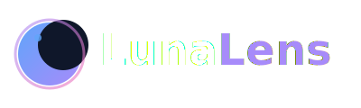
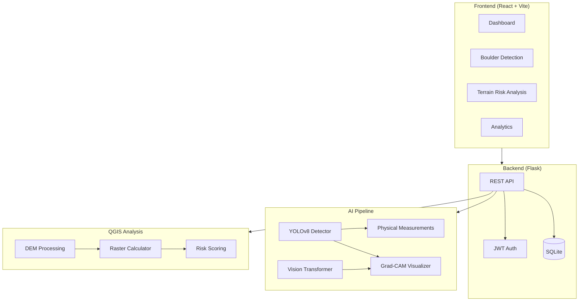

<p align="center">
  
</p>

<p align="center">
  <strong>AI-Powered Lunar Surface Analysis Platform</strong>
</p>

<p align="center">
  <a href="https://github.com/bhuwanb23/lunalens/actions"></a>
  <a href="./LICENSE"></a>
  <a href="https://github.com/bhuwanb23/lunalens/stargazers"></a>
  <a href="https://github.com/bhuwanb23/lunalens/network/members"></a>
</p>

---

<p align="center">
  <strong>ISRO Bharatiya Antariksh Hackathon 2025 -- Finalist</strong><br>
  <sub>Selected for the finals of India's national hackathon for lunar exploration and research.</sub>
</p>

<p align="center">
  <a href="./Bharatiya%20Antariksh%20Hackathon%202025%20Idea%20Submission.pdf">View the submission (PDF)</a>
</p>

---

## Overview

LunaLens is a full-stack web application that combines AI-powered boulder detection, QGIS-based terrain risk analysis, and a modern React frontend for lunar surface research. It supports mission planners and researchers in identifying hazards and assessing terrain risk on the lunar surface.

The platform uses YOLOv8 with a Vision Transformer fallback for boulder detection, multi-parameter composite risk scoring for terrain analysis, and provides real-time dashboards and analytics for tracking results.

## Key Features

| Feature | Description |
|---------|-------------|
| **Boulder Detection** | YOLOv8 primary detector with Vision Transformer fallback. Physical measurements (diameter, volume, circularity, elongation) and Grad-CAM visualizations. |
| **Terrain Risk Analysis** | QGIS-based multi-parameter risk assessment covering slope, aspect, hillshade, roughness, and elevation. Weighted composite scoring (0-100). |
| **Interactive Dashboard** | Real-time analytics, scan history, and quick-action navigation across detection modules. |
| **Secure Authentication** | JWT-based user management with role-based access control (admin, researcher, user). |
| **REST API** | Full API for boulder detection, terrain analysis, analytics, and file management. |
| **Docker Deployment** | Containerized setup with Docker Compose for local and production deployment. |

## Architecture



## Quick Start

### Prerequisites

- Node.js v18+
- Python 3.11+
- QGIS 3.x (optional, for terrain analysis)

### Local Development

```bash
git clone https://github.com/bhuwanb23/lunalens.git
cd lunalens

# Backend
cd backend
pip install -r requirements.txt
cd server
cp env.example .env
python setup_database.py
python app.py

# Frontend (new terminal)
cd frontend/website
cp .env.example .env
npm install
npm run dev
```

Frontend: `http://localhost:5173` | Backend: `http://localhost:5000`

### Docker

```bash
git clone https://github.com/bhuwanb23/lunalens.git
cd lunalens

export SECRET_KEY=$(python -c "import secrets; print(secrets.token_hex(32))")
export JWT_SECRET_KEY=$(python -c "import secrets; print(secrets.token_hex(32))")

docker-compose up --build
```

Frontend: `http://localhost` | Backend: `http://localhost:5000`

### Demo Credentials

| Mission ID | Access Code | Role |
|------------|-------------|------|
| `isro123` | `isro123@2024` | Admin |
| `mission001` | `mission001@2024` | User |
| `research002` | `research002@2024` | Researcher |
| `test001` | `test001@2024` | Test User |

## How It Works

1. **Upload** -- Users upload lunar surface imagery (DEM files or photographs) through the web interface.
2. **Detect** -- The AI pipeline runs YOLOv8 for boulder detection, with a Vision Transformer validating low-confidence results. Physical measurements are computed for each detected object.
3. **Analyze** -- QGIS-based terrain risk analysis processes DEM data across multiple parameters to produce a weighted composite risk score.
4. **Visualize** -- Results are displayed through interactive dashboards with Grad-CAM attention maps, detection overlays, and analytics.

## Deployment

### Docker (Recommended)

```bash
docker-compose up --build -d
```

### PaaS (Render, Railway, Heroku)

The project includes a `Procfile` for PaaS deployment. Set environment variables:
- `SECRET_KEY` -- Random hex string for session signing
- `JWT_SECRET_KEY` -- Random hex string for JWT tokens
- `FLASK_CONFIG=production`
- `ALLOW_EXTERNAL_ACCESS=true`

### Manual

```bash
cd backend/server
pip install gunicorn
gunicorn -w 4 -b 0.0.0.0:5000 --timeout 120 app:app
```

Build the frontend and serve `dist/` with nginx or any static file server.

## Releases

See the [Releases page](https://github.com/bhuwanb23/lunalens/releases) for published versions.

## Changelog

See [CHANGELOG.md](CHANGELOG.md) for a detailed history of changes.

## Contributing

See [CONTRIBUTING.md](CONTRIBUTING.md) for development setup, branch conventions, and PR guidelines.

### Good First Issues

Check the [Issues page](https://github.com/bhuwanb23/lunalens/issues) for bugs and feature requests.

## Team

| Name | Role |
|------|------|
| Bhuwan B | Project Lead |
| Nishanth P | ML Architect |
| Avinash A | QGIS Expertise |
| Mukesh V | Researcher and Developer |
| Padmanaban G | Developer |
| Dhanush KB | Data Analyst |

## License

This project is licensed under the MIT License -- see [LICENSE](LICENSE) for details.
